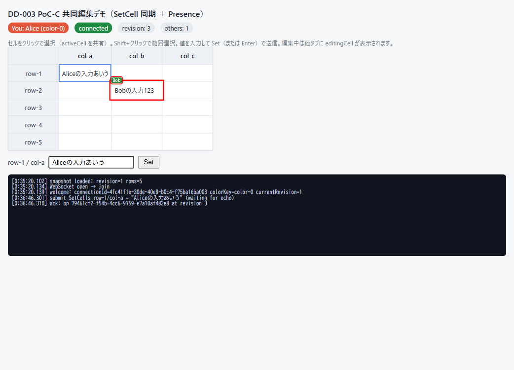
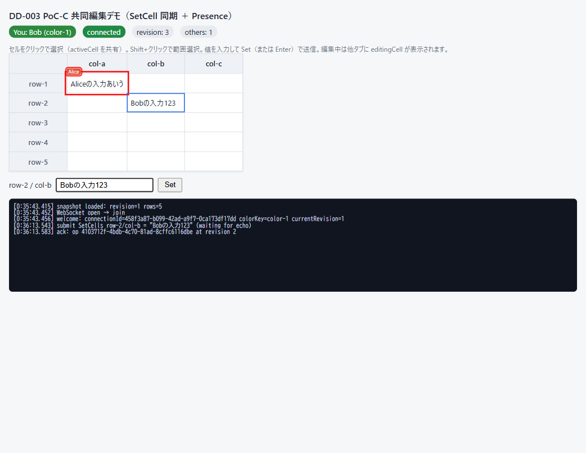

# DD-003: PoC-C共同編集Operation

| 作成日 | 更新日 | ステータス | 補足 |
|--------|--------|-----------|------|
| 2026-07-11 | 2026-07-12 | 完了 | Operation収束性を実証（10,000件×3〜10体でhash一致・二重適用0・AC1〜5合格）。sheet-core/sheet-server-core/collaboration-server実装＋ADR-005/008ドラフト |

> アプローチ: TDD（決定論的適用・シーケンサー・rollback/replay＝計画書 §7/§8 に「正解」が明確なロジック中心）＋標準（WSアダプター・試験ハーネス）

## 目的

「サーバー主導の全順序Operationログ＋楽観適用rollback/replayが、切断・競合・重複を経ても収束するか」を検証するPoC-C（計画書 §18.3）。`sheet-core` / `sheet-server-core` の最小実装＋開発用WSサーバー＋ヘッドレスNodeクライアント群（3〜10体）で自動検証し、Phase 0 No-Go条件「Operation収束性」と ADR-005（サーバー主導型全順序Operationログ）・ADR-008（楽観適用＋rollback/replay）の判断材料を作る。

## 背景・課題

- 正典は計画書 `doc/plan/nanairo_realtime_spreadsheet_development_plan_v1.md` の **§18.3（PoC-C実装範囲・合格条件）**。設計根拠は §3.4（一貫性モデル）・§7（Command/Operationモデル）・§8（WebSocketプロトコル）・§9（Presence）・§10（競合解決）・Appendix A（Operation例）。`doc/plan/phase0-dd-roadmap.md` ④に対応。
- 「rollback/replayが入力遅延を恒常的に発生させる」はPhase 0のNo-Go条件（§18.6）。ADR-005/008 の決定期限は Phase 0 終了時（§4）。
- DD-001 で monorepo 基盤構築済み（`sheet-types` ブランド型・vitest ルート集約 `packages/**`+`apps/**`・tsconfig.base は DOM lib なし）。packages/* はランタイム依存ゼロ原則（ADR-022・§3.6）。
- 実装順は ②→④→③→⑤。本DDの実装は **DD-002（PoC-A）のコードがコミットされた後に開始**する（同一ツリーでの同時実装をしない。`package-lock.json` 同時更新とCodexレビュー差分の混線を避ける）。

## 検討内容

- **実装先**: `packages/sheet-core`・`packages/sheet-server-core`（§5.1 の名前に合わせる）＋ `apps/collaboration-server`（§17.1 の開発用サーバー。ランタイム依存 hono / `@hono/node-server` / ws を許すのはこのアプリのみ＝§3.6）。ヘッドレスクライアント（楽観適用・rollback/replay・再接続）は専用パッケージを新設せず、collaboration-server 内の**依存ゼロ・トランスポート注入の分離モジュール**とし、Phase 1 で `sheet-collaboration` へ昇格しやすくする。
- **検証は自動中心（ヘッドレス）**: 収束試験は in-process フォールト注入トランスポート（シード付きPRNGで重複・欠落・遅延・切断を再現可能に注入）を主とする。実WSで10,000件を回すとタイミング非決定でシード再現性が壊れるため、実WSは縮小スモークと再起動復元試験に限定する。
- **サーバー再起動の模擬**: in-memoryスナップショット＋OperationログをJSONへエクスポート/インポート可能にし、「新インスタンスを復元起動→クライアント再接続→catch-up」で検証する（DB永続化＝§16 はスコープ外）。
- **スコープ外**: 列操作・数式・スタイル・Undo・MoveRows・セル結合・認証/認可（§8.7）・大量Operation transport（§8.6）・DB永続化・ブラウザーUI（`apps/playground` には触れない＝PoC-A/Bの場所）。プロトコル契約テストは §20.3 のうち**重複・欠落・stale revision のみ**（protocolVersion不一致等は後続）。
- **ADR**: 成果を `doc/adr/` の ADR-005・ADR-008 ドラフトへ記録する（状態はProposedのまま。Go/No-Go確定はロードマップ⑥）。

## 決定事項

- **Operationは3種のみ**（§7.4/7.5・Appendix A準拠）: `SetCells`（conflictPolicy は `reject-overlap` 固定）／`InsertRows`（`afterRowId` アンカー・新RowIdはOperationに同梱）／`DeleteRows`（rowIds指定・スロットtombstone化）。Envelopeは §7.3 の Client/Server 両形式。
- **Operationの原子性・境界仕様**（2026-07-11 ユーザー指摘で明記。scenarios/protocol-subset に具体例を書く）:
  - **SetCells は全件適用または全件拒否の原子的Operation**（§7.5「貼り付けはTransaction単位で原子的」「MVPは全成功／全失敗」）。changes 内に1件でも stale／不正があれば Operation 全体を reject し、部分適用しない。
  - **tombstone化された既知アンカーへの InsertRows**: `afterRowId` が既に DeleteRows で tombstone 済みの場合、**アンカーは論理表示順上の参照点として有効**（tombstone はスロット回収を遅延するだけで順序参照は残す）とし、その直後へ挿入する。アンカーが未知ID（一度も存在しない）の場合は reject。
  - **削除済み行への再Delete**: DeleteRows の rowIds に tombstone 済みIDが含まれる場合は**冪等に無視**（該当IDは no-op、残りは適用）。全件が削除済みなら changeSet 空で成功（エラーにしない）。
  - **`clientSequence` は `clientSessionId` 単位**で単調増加・検査する（同一ユーザーが複数タブ/接続を持つ場合、接続ごとに独立した列にする。§7.3 の `clientId` を接続＝セッション識別子として扱う）。
- **適用関数は §7.6 決定論を厳守**: 時刻・乱数・DOM・ネットワーク非参照／同一入力→同一結果／`ApplyResult`（changeSet・inverseSeed・dirtyRegions・formulaInvalidations）返却／不正Operation（削除済み行へのSetCells等）は明示エラー。ID採番は適用関数の外（クライアントCommand側の `crypto.randomUUID()`）。
- **文書ハッシュ**: 正準直列化（行順・セル内容・lastChangedRevision）＋純TSのFNV-1a 64bit（依存ゼロ・Node/ブラウザー共通。Node crypto に依存しない）。
- **サーバーは §8.4 準拠**: revision単調付与・`operationId` 冪等（重複は二重適用せず同一ACKを再返却）・`baseRevision` 検証・セル `beforeRevision` 照合（staleは `operationRejected`＋現在値/現在revision返却＝§10.2）・`clientSequence` 検査。Roomはトランスポート非依存（メッセージin/outインターフェース）。
- **クライアントは §7.7 の6手順**（pending逆順rollback→server Operation適用→own除去→残pending再検証→再適用→不成立はConflict Queueへ）。`nextExpectedRevision` で欠落検知→`requestCatchup`、期待値より小さいrevisionは重複として無視（§8.4）。再接続は §8.5（先にサーバー差分取得→未送信Operationを再検証・再送）。競合時のローカル入力は Conflict Queue にコピー可能な形で保持する（§10.1-1/6。IMEドラフト保全の完全実装はPoC-A側）。
- **Presenceは §9 準拠・connection単位**（2026-07-11 ユーザー指摘で拡張）: 非永続・単調 `sequence`（古い更新は破棄）・`presenceSnapshot`／`presenceDelta`／`presenceRemoved`。
  - **共有フィールド**: `activeCell`・`selectionRanges`・`editingCell`（§9.2 の3種）＋ `connectionId`・`userId`・`displayName`・`colorKey`（表示・識別用）。
  - **管理単位は connection（`connectionId`）**: 同一 `userId` でも接続ごとに別 Presence として扱う。`colorKey` はサーバーが接続単位で割り当てる（§9.4 同色衝突回避）。
  - **TTL削除**: heartbeat（§9.3 目安5秒）受信のたびに接続の有効期限を更新し、**TTL（目安15秒）を超えて heartbeat が途絶えた接続は `presenceRemoved` で削除**する。正常 close は即時削除、異常切断は TTL で削除（§9.3）。TTL判定は**注入クロック**で行う（テスト可能にする。§7.6 の時刻/乱数非参照は Operation 適用関数に課す制約で、サーバーの接続管理は対象外）。
- **メッセージは §8.3 のPoCサブセット**（join／welcome／submitOperation／operationAck／operationRejected／operations／requestCatchup／presence系／heartbeat系）。フィールド定義・rejectコード等の詳細は `DD-003/protocol-subset.md` へ分離（50行超のため）。

### 起票時「要確認」3点の回答（2026-07-11 ユーザー合意で確定）

1. **2ブラウザーの最小デバッグデモを含める**（2026-07-11 ユーザー指摘で確定）。`apps/collaboration-server` が配信する最小HTML（依存なし・素のWS/DOM）で、2タブ間の SetCell 同期と Presence（他タブのアクティブセル/選択/編集中）を目視できるようにする。合格判定自体はヘッドレス試験で行い、デモは体感確認・デバッグ用（`apps/playground` には触れない）。
2. **PresenceのPoC範囲は3種フル＋識別フィールド**（activeCell・selectionRanges・editingCell ＋ connectionId・userId・displayName・colorKey。connection単位管理・TTL削除。上記「Presenceは §9 準拠・connection単位」を参照）。
3. **ランタイム依存の追加を承認**: `apps/collaboration-server` のみに hono / `@hono/node-server` / ws を追加（§3.6「アダプター層のみ許可」の範囲内。packages/* はゼロ依存維持）。

## 受け入れ基準

計画書 §18.3 合格条件をそのまま使う。検証は自動中心（vitest・シード付きで再現可能）。

| # | 基準（操作 → 期待結果） | 検証方法 | 判定 |
|---|------------------------|---------|------|
| 1 | 3〜10クライアントで10,000件のランダムOperation（重複・遅延・切断再接続を注入）→ 全クライアント＋サーバーの文書hash一致 | `test/convergence.test.ts`（3体/10体×10,000・S-M2再現）＋`test/ws-convergence.smoke.test.ts`（実WS 3×1,000件） | ✅ 収束（hash＋構造deep-equal＋ログreplay hash・二重適用0・ops/sec 5,300〜10,800） |
| 2 | 同一Operationを重複送信 → 二重適用0件・同一ACK再返却 | `sequencer.test.ts`（S-F2）＋`test/protocol-contract.test.ts`（重複・サーバー冪等＋クライアント dedup） | ✅ 同一ACK再返却・ログ長/ hash不変 |
| 3 | operations の revision 欠落 → 検知して requestCatchup で自動追従・hash一致 | `catchup.test.ts`＋`test/protocol-contract.test.ts`（欠落→requestCatchup{afterRev-1}→追従） | ✅ off-by-one 無し・追従して hash一致 |
| 4 | 同一セル競合（stale beforeRevision）→ サーバーreject・ローカル入力をConflict Queueへ保持（消失0件） | `sequencer.test.ts`/`session.test.ts`＋`test/protocol-contract.test.ts`（stale＋切断経由reject喪失=D27境界） | ✅ operationRejected〔現在値/現在revision〕・入力保全（消失0） |
| 5 | サーバー再起動（snapshot＋logから新インスタンス復元起動）→ 再接続クライアントがcatch-upで収束・hash一致 | `test/restart-restore.test.ts`（実WS・同一ポート復元・S-K1〜K4・D18） | ✅ 復元hash一致・revision継続・catch-up収束 |

## タスク一覧

### Phase 0: 事前精査
- [x] 📋 **各Phaseのタスク精査・詳細化**: 受け入れ基準 AC1〜5 は全て「操作→期待結果」で記述され、各 Phase の検証タスク（Phase 1〜5・ファイルパス具体・各 Phase に🔬）に対応。精査の追記: (a) AC1 の hash 決定論は `hash.ts` の正準化ルール（Map反復順/`localeCompare` 非依存）に依存するため phase1-design/protocol-subset に明文化（DA D1）。(b) AC2 の「重複→同一ACK」はサーバー処理順（operationId 冪等を clientSequence 検査より先）に依存するため protocol-subset §5 で明文化（DA D3）。(c) Presence は §18.3 合格条件に無い追加スコープだが Phase 2 `presence.ts` ユニット＋Phase 4 smoke で検証（scenarios L）。ファイルパス・変更内容・🔬 の不足なし。
- [x] 📐 **実装前詳細化トリガー判定**: **Phase 1=要**（新規パッケージ・4ファイル・決定論適用＝下記「Phase 1 詳細設計」で実施済み）／**Phase 2=要**（新規パッケージ・5ファイル・並行/状態遷移＝sequencer/room/presence。実装直前に📐）／**Phase 3=要**（committed/pending 二層・rollback/replay の複雑な状態遷移。実装直前に📐）／**Phase 4=要（軽）**（WSアダプター・接続ライフサイクル・デモHTML）／**Phase 5=不要**（ハーネス/試験中心・新規設計判断なし）。Phase 2〜4 の詳細化はユーザーレビュー対象（自動継続ルール外の設計は本 Phase 0 の scenarios/protocol-subset に集約済み）。
- [x] 🧪 **テスト設計（Red）**: `doc/DD/DD-003/scenarios.md`（新規・自然言語・70シナリオ／13カテゴリ A〜M）を作成。決定論適用/hash・SetCells原子性・InsertRowsアンカー（tombstone/未知）・DeleteRows冪等・冪等/clientSequence・競合reject（stale／削除行 §10.3）・rollback/replay（own除去・reject後 Conflict Queue）・欠落catch-up・再接続（§8.5）・スナップショット復元・Presence（sequence/TTL）・収束（フォールト注入メタ検証）を網羅。**ユーザーレビュー・合意後にコード化**。
- [x] `doc/DD/DD-003/protocol-subset.md`（新規）作成: 採用メッセージ・Envelope 必須フィールド（`clientSequence` は clientId=clientSessionId 単位・clientId/connectionId 識別子モデル）・rejectコード7種・**サーバー処理順**・Operation境界4点・Presence フィールド/配信/TTL（注入クロック）・初期接続/catch-up（off-by-one 明記）/再接続手順を定義。scenarios と同時にレビュー。
- [x] 🧑‍⚖️ **Codexレビュー要否判定**: **必須**〔TDD対象＋並行処理・複雑な状態遷移＋外部I/F=WSプロトコル〕・effort: **high**〔xhigh トリガー非該当＝データ移行/認可変更なし〕で確定。`bash scripts/codex-review.sh --check`=利用可（exit 0・codex-cli 0.144.0-alpha.4・トークン消費なし）。実行は Phase 5 で全差分に1回。
- [x] 😈 **Devil's Advocate調査**: 3ラウンド実施（R1 広域→R2 クライアント/再接続→R3 保守/統合。R2・R3 で新規 Critical 0＝収束）。Critical 2・Warning 6・Info 1。§7.6 決定論違反の混入経路（Map反復順・環境依存整列）と「テストのための実装」化（フォールト未発火・弱い収束assert）を重点。詳細は下記「DA批判レビュー記録」#1〜9。設計クラリフィケーションは scenarios/protocol-subset/phase1-design に反映済み。

#### Phase 1 詳細設計（📐 詳細化要 → モジュール境界・公開シグネチャ）

`@nanairo-sheet/sheet-core` 最小の詳細設計は `doc/DD/DD-003/phase1-design.md`（新規）へ分離（15行超のため。guides.md §6）。要点:

- **依存 DAG（循環なし）**: `sheet-types` ← `document.ts` ← `operations.ts` ← `apply.ts`／`hash.ts` ← `index.ts`。全て DOM/Canvas/React/Hono 非参照・ランタイム依存ゼロ。apply はサーバー/クライアント共有（§5.3）。
- **`document.ts`**: `SheetDocument{revision, rowOrder(tombstone含む), rowMeta:Map, columnOrder(固定), cells:二段Map}`＋`RowMeta{id,slot,tombstone,lastChangedRevision}`。純粋関数 `createDocument/cloneDocument/getCell/displayRowOrder/resolveAnchorIndex/isTombstoned`。**rowOrder は tombstone を保持しアンカー解決の基準に、表示は displayRowOrder で除外**（DA D2）。
- **`operations.ts`**: `SetCells/InsertRows/DeleteRows` と Client/Server Envelope・`CellScalar`。ID 採番は含めない（§7.6）。
- **`apply.ts`**: `applyOperation(doc, op, ctx:{revision}): ApplyResult`。付与 revision は呼び出し側注入（時刻/乱数非参照）。**二相適用（validate-all→commit）で SetCells 原子性・部分ミューテーション無し**（DA D5）。不正は `ApplyError{code}`（unknown-row/target-row-deleted/unknown-anchor）。
- **`ApplyResult`**: `{document, changeSet, inverseSeed, dirtyRegions:RowId[], formulaInvalidations:[]}`。`ChangeSet{cells:[{rowId,columnId,before,after}], rowsInserted, rowsDeleted}`・`InverseSeed`（rollback 用逆操作データ・Phase 3 で消費）。
- **`hash.ts`**: `canonicalSerialize`（displayRowOrder × columnOrder 順・非空セルのみ・**Map反復順/localeCompare 非依存**・DA D1）＋`fnv1a64`（BigInt 64bit・crypto 非依存）＋`documentHash`。**committed 静止点でのみ hash 一致を主張**（I-4）。

### Phase 1: sheet-core 最小（TDD）
- [x] 📐 **実装前詳細化**（Phase 0「Phase 1 詳細設計」＝`DD-003/phase1-design.md` に記載済み。モジュール境界・公開シグネチャ・ApplyResult/ChangeSet 確定。ユーザーレビュー後にコーディング）
- [x] **Red**: `packages/sheet-core/src/{document,apply,hash}.test.ts`（新規）へ scenarios 該当分をコード化 → 全件 import 失敗（モジュール未実装）で Red 確認
- [x] `packages/sheet-core/package.json`・`tsconfig.json`（新規）: `@nanairo-sheet/sheet-core` ワークスペース追加（ランタイム依存ゼロ・`@nanairo-sheet/sheet-types` を playground と同方式で `devDependencies:"*"` 参照。tsconfig は sheet-types 同型＝`lib:["ES2022"]`/`types:[]`）
- [x] `packages/sheet-core/src/document.ts`（新規）: 最小文書モデル（`rowOrder`〔tombstone保持〕＋`RowMeta`・固定ColumnId列・Map二段CellStore・`displayRowOrder`/`resolveAnchorIndex`/`cloneDocument`〔深いコピー〕）
- [x] `packages/sheet-core/src/operations.ts`（新規）: SetCells／InsertRows／DeleteRows 型・`CellScalar`・Client/Server Envelope 型（§7.3〜7.5・ブランド型使用）
- [x] `packages/sheet-core/src/apply.ts`（新規）: 決定論的適用（§7.6・二相validate→commit・ApplyResult返却・構造3種の明示エラー・ID生成なし・beforeRevision非参照）＋`index.ts`
- [x] `packages/sheet-core/src/hash.ts`（新規）: 正準直列化（長さ前置・Map反復順/localeCompare非依存）＋FNV-1a 64bit（BigInt・UTF-8バイト）
- [x] **Green→Refactor**: 最小実装で全pass（54件）→整理（テスト green 維持）
- [x] 🔬 **機械検証**: 本DDスコープ限定で green（`npx vitest run packages/sheet-core`=54 pass／`npm run typecheck --workspace packages/sheet-core`／`npx eslint packages/sheet-core`）＋シード付きランダム列で「同一Operation列→同一hash」を6シードで確認
- [x] 😈 **DA批判レビュー**（基準: da-method.md §3.4。§7.6違反 grep=クリーン・cloneDocument深さ・InverseSeed十分性・区切り衝突を確認。新規発見 D10〜D16 を下表へ追記）

### Phase 2: sheet-server-core 最小（TDD）
- [x] 📐 **実装前詳細化**（Sequencer/Room/Presence/Snapshot の責務分割・メッセージin/outインターフェース・公開シグネチャ＝`DD-003/phase2-design.md` に記載。主セッション指示 1〜6 を反映。夜間自動進行のためユーザー停止せず主セッションが後検証）
- [x] **Red**: `packages/sheet-server-core/src/*.test.ts`（新規）へ冪等・stale reject・catch-up・スナップショット復元のシナリオをコード化 → モジュール未実装で失敗確認（sheet-core `validate.test.ts` は validate.ts 実装前に Red）。加えて §5 処理順の入れ替えで F2/F3/E3 が失敗することをミューテーションで実証（3失敗→revert で green・DA D3 回帰防止）
- [x] **共有バリデーター（指示 1）**: `packages/sheet-core/src/validate.ts`（新規・テスト付き）に `validateOperation(doc,op): OperationViolation[]`（構造3種＋stale＋duplicate-row）を実装・export。sequencer とクライアント（Phase 3）が同一関数で判定＝乖離防止。`applyOperation` 本体は不変
- [x] **プロトコル型（指示 2）**: `packages/sheet-core/src/protocol.ts`（新規・型のみ）に Client/Server メッセージ union・RejectCode・UserPresence 等を定義。server-core と Phase 3 クライアントが import（クライアントは server-core 非依存）
- [x] `packages/sheet-server-core/package.json`・`tsconfig.json`（新規）: ワークスペース追加（ランタイム依存ゼロ・sheet-types／sheet-core を `devDependencies:"*"` 参照・typecheck script。tsconfig は sheet-core 同型＝`lib:["ES2022"]`/`types:[]`）
- [x] `packages/sheet-server-core/src/sequencer.ts`（新規）: revision単調付与・operationId冪等（既知IDは同一ACK再返却・二重適用しない）・baseRevision検証・`validateOperation` 使用（stale→`stale-cell-revision`・現在値/現在revision）・**SetCells原子性**（1件でもstale/不正なら全体reject・全違反列挙）・**clientSequence を clientId 単位で検査**・**再Delete冪等（no-op=revision非消費・ACK/ackCache/seq前進）・duplicate-row**の境界処理。§5 処理順厳守
- [x] `packages/sheet-server-core/src/room.ts`（新規）: 権威文書＋Operationログ保持・join処理（lastAppliedRevision以降を返却＋welcome/connectionId払い出し）・requestCatchup応答（fromRevision=afterRevision+1）・**Presence中継（connection単位・sequence比較・heartbeat受信でTTL更新・TTL超過/切断で`presenceRemoved`。TTL判定は注入クロック）**— トランスポート非依存（メッセージin/out＝`Outbound[]` を返す純粋IF・注入 idGenerator/clock）
- [x] `packages/sheet-server-core/src/presence.ts`（新規）: connection単位のPresenceレジストリ（activeCell/selectionRanges/editingCell/connectionId/userId/displayName/colorKey・**colorKey決定論割当＝未使用最小index・close/sweepで解放再利用**・注入クロック＋明示`sweep()`でのTTL失効）
- [x] `packages/sheet-server-core/src/snapshot.ts`（新規）: snapshot＋OperationログのJSONエクスポート/インポート（`{document,operationLog,currentRevision,ackCache,clientSequenceTable}` 全部・指示5）＋整合検証 `verifySnapshotIntegrity`（document hash == ログreplay hash・S-K1/K2・DA D7）
- [x] **Green→Refactor** ＋ 🔬 **機械検証**: 本DDスコープ限定で green（`npx vitest run packages/sheet-core packages/sheet-server-core`=119 pass／`npm run typecheck --workspace packages/sheet-core --workspace packages/sheet-server-core`／`npx eslint packages/sheet-core packages/sheet-server-core`）
- [x] 😈 **DA批判レビュー**（冪等キャッシュとログの整合＝no-op ACK の restore 復元・catch-up境界off-by-one・restore後の再送誤reject経路・処理順回帰・Presence sweep発火。新規発見 D17〜D21 を下表へ追記）

### Phase 3: ヘッドレスクライアント（TDD・楽観適用＋rollback/replay）
- [x] 📐 **実装前詳細化**（committed/pending二層・Conflict Queue・トランスポートIF＝`DD-003/phase3-design.md` に記載。§7.7 6手順のデータフロー・再送ポリシー・再接続手順・catch-up バッファ・Presence 識別伝搬・フォールト注入カウンターを確定。主セッション指示 1〜5 を反映）
- [x] **Red**: `apps/collaboration-server/src/client-session/{session,catchup,reconnect,inprocess-transport}.test.ts`（新規・H1〜H5/I1〜I5/J1〜J5/G2・G3＋再送ポリシー）をコード化 → ./session 等未実装で import 失敗（全滅）を確認
- [x] `apps/collaboration-server/package.json`・`tsconfig.json`（新規）: ワークスペース追加（ランタイム依存なし・sheet-types/sheet-core/sheet-server-core を devDependencies `"*"` 参照。tsconfig は `lib:["ES2022"]`/`types:[]`）
- [x] `apps/collaboration-server/src/client-session/session.ts`（新規・依存ゼロ・トランスポート注入）: committed/pending二層・楽観適用＋§7.7 rollback/replay（`applyInverseSeed` 逆順・own除去・残pending`validateOperation`再検証・依存失効連鎖・不成立はConflict Queue）・nextExpectedRevision・requestCatchup（gap即時＋周期poll）・Conflict Queue（コピー可能）・Presence送信（単調sequence・welcome.colorKey）・再接続（§8.5）・再送タイマー（注入クロック）。非相対importは sheet-core/sheet-types のみ（＋`./deps`）
- [x] `apps/collaboration-server/src/client-session/inprocess-transport.ts`（新規）: Room直結ハブ＋シード付きmulberry32フォールト注入（重複/欠落/遅延=イベントキュー順序操作/切断）＋発火カウンター（指示5）。session本体は非依存を維持（transportはインターフェース注入）
- [x] **Green→Refactor** ＋ 🔬 **機械検証**: 本DDスコープ限定で green（`npx vitest run packages/sheet-core packages/sheet-server-core apps/collaboration-server`=**152 pass**〔sheet-core 68・sheet-server-core 51・collaboration-server 33〕／`npm run typecheck --workspace …`／`npx eslint …`）＋25シード×3クライアント収束＋競合収束を検証（DA用スクラッチ・恒久回帰は inprocess-transport.test へ集約）
- [x] 😈 **DA批判レビュー**（own受信とpending除去の競合窓・catch-up待ち中の新着・rollback/replay割り込み不変条件・再送とConflict Queueの排他・逆操作復元完全性・切断上限。新規発見 **D22〜D27** を下表へ追記）

### Phase 4: 開発用WSサーバーアダプター（Hono + @hono/node-server + ws）
- [x] 📐 **実装前詳細化**（HTTP/WSエンドポイント・接続ライフサイクル・後始末＝`DD-003/phase4-design.md` に記載。主セッションレビュー指示 1〜5 を反映。夜間自動進行のためユーザー停止せず主セッションが後検証）
- [x] `apps/collaboration-server/package.json`: hono / `@hono/node-server` / ws を dependencies へ、`@types/node`・`@types/ws`・tsx を devDependencies へ追加＋`dev`（tsx で server.ts 起動）script（要確認3の合意済み。packages/* には追加せず＝git diff packages/ 空・lockfile 追加は6依存＋推移的のみ）
- [x] `apps/collaboration-server/src/server.ts`（新規）: §8.2 初期接続（HTTP GET /snapshot〔revision付きJSON〕→ WS join → welcome＋R+1以降を送信）＋ `protocol-subset.md` §1 全メッセージを Room へ配線・demo.html 静的配信・起動/停止API（`startServer(options):Promise<{port,close()…}>`）・エラーハンドリング（不正JSON→close・join前メッセージ→無視）・実クロック/実タイマー注入（指示1）・main ガードで `dev` 起動
- [x] `apps/collaboration-server/src/client-session/ws-transport.ts`（新規）: ws（Node client）を使う実WSトランスポート（phase3-design §4 の `ClientTransport` 実装・client-session へ注入・再接続対応）。＋純粋 `message-codec.ts`（JSON境界の型安全デコード）・`ws-frame.ts`（RawData→string・node）
- [x] `apps/collaboration-server/public/demo.html`（新規）: **2ブラウザー最小デバッグデモ**（完全依存ゼロ＝CDN/import/fetchライブラリ無し・素WS/DOM・簡易グリッド）。2タブで SetCell 同期（送信→echo反映・楽観適用なし）と Presence（他タブの activeCell/selectionRanges/editingCell を colorKey 色の枠＋displayName で表示）を目視。userId/displayName は URL パラメーター or プロンプト。`server.ts` で静的配信
- [x] 🔬 **機械検証**: `apps/collaboration-server/src/server.smoke.test.ts`（新規・vitest・ランダムポート）: サーバー起動→**ws-transport 経由で ClientSession 3 体接続**→SetCells相互反映→全クライアント＋サーバーhash一致・pending0・presenceDelta到達（displayName/colorKey/activeCell含む）・heartbeat途絶接続が短縮TTLで`presenceRemoved`→ green・後始末リーク無し（プロセス自然終了）
- [x] 📸 **エビデンス**: 2タブでの SetCell 同期・Presence 表示のキャプチャ（`DD-003/` へ配置。2026-07-12 主セッションが Playwright MCP で取得＝下記エビデンス表・ログ参照）
- [x] 😈 **DA批判レビュー**（切断イベントの取りこぼし・catch-up中送信順・テスト間のポート/プロセス後始末・デモHTMLの依存混入・ws message順序/バックプレッシャー。新規発見 **D28〜D32** を下表へ追記）

### Phase 5: 収束・契約・復元試験＋ADRドラフト＋Codexレビュー
- [x] `apps/collaboration-server/test/convergence.test.ts`(新規): **10,000件ランダムOperation収束試験**（3体/10体×10,000＋S-M2再現。SetCells/InsertRows/DeleteRows混合・シード付きPRNG・フォールト注入→全hash一致・二重適用0・失敗時シード出力）
- [x] `apps/collaboration-server/test/ws-convergence.smoke.test.ts`（新規）: 実WS縮小スモーク（3クライアント×**各1,000件**＝計3,000件 → hash一致・Codex[P2]反映）
- [x] `apps/collaboration-server/test/protocol-contract.test.ts`（新規）: §20.3 — 重複／欠落／stale＋**切断経由reject喪失（D27境界）**の4シナリオ
- [x] `apps/collaboration-server/test/restart-restore.test.ts`（新規・実WS）: 停止→snapshot import で同一ポート復元→再接続catch-up→hash一致・revision継続（S-K1〜K4・D18）
- [x] `doc/adr/0005-server-ordered-operation-log.md`・`doc/adr/0008-optimistic-apply-rollback-replay.md`（新規・Status: Proposed）＋`doc/DOC-MAP.md` へ追記
- [x] 🔬 **機械検証**: `npx vitest run packages/sheet-core packages/sheet-server-core apps/collaboration-server`=**163 pass**・typecheck×3＋typecheck:core エラー0・eslint exit 0・`doc-check.sh` エラー0（ルート `test`/`build` は playground 巻き込み回避で不実行＝朝の一括green確認）
- [x] 😈 **DA批判レビュー**（D33〜D37を`DD-003/da-review-log.md`へ。フォールト実発火メタ検証・「たまたま収束」否定・rollback/replay遅延観察＝No-Go材料）
- [x] Codexレビュー自動実行（依頼書 `DD-003/codex-review-request.md` → `bash scripts/codex-review.sh --uncommitted` → `DD-003/codex-review-result.md`・effort high・findings 6件）
- [x] Codexレビュー指摘への対応（[P1]acked-noop除去・[P2]snapshot整合強化・[P2]ws各1,000件・[P2]restore主張是正 を修正／[P1]入力検証・clientId拘束はスコープ外〔§8.7認証・両端自製〕で見送り＝要判断）

## エビデンス

| After | 説明 |
|-------|------|
|  | ✅ Aliceタブ: Bobの入力「Bobの入力123」(row-2/col-b)が同期・BobのactiveCellバッジ表示（赤枠強調） |
|  | ✅ Bobタブ: Aliceの入力「Aliceの入力あいう」(row-1/col-a)が同期・AliceのPresenceバッジ表示（赤枠強調） |

## ログ

> 各 Phase の実装詳細・日付別ログは [`DD-003/implementation-log.md`](DD-003/implementation-log.md) へ分離（guides.md §6）。以下は**ユーザー合意・裁定**（正本・改変せず保持）と各 Phase の 2〜3 行要約。

### 合意・裁定（正本）

- **2026-07-11 仕様確認ゲート（ユーザー合意）**: 要確認3点を確定 — ① 2ブラウザー最小デバッグデモを含める ② Presence は3種フル＋識別フィールド（connection単位管理・heartbeat TTL削除）③ `apps/collaboration-server` への hono/@hono/node-server/ws 追加を承認。Operation境界仕様（SetCells原子性・tombstoneアンカーInsertRows・再Delete冪等無視・`clientSequence`=`clientSessionId`単位）を明記。スコープ改名 `@nanairo-sheet/*`。
- **2026-07-11 Q-1〜Q-5 裁定（主セッション代行・朝の確認対象）**: Q-1=no-opは「空changeSet（全件tombstone済みDeleteRows）」のみ・revision非消費（同値SetCellsはno-op扱いしない）／Q-2=clientSequence欠番はreject＋先頭再送／Q-3=Conflict Queueは保持のみ・自動再送なし／Q-4=切断上限30秒/100Operation／Q-5=実WSスモークは3クライアント×1,000件。
- **夜間自動進行の合意（2026-07-11 夜）**: 就寝中はレビュー待ちをスキップし進められるところまで自動進行（**コミットしない**・朝に一括レビュー）。各Phaseゲートは主セッションのレビュー＋DA＋Codexで代行し本DDを朝の確認対象とする。
- **2026-07-12 ユーザーレビューOK → 完了**: 朝の一括レビューで承認。要判断2点も承認 — ① Codex見送り2件（message-codec再帰入力検証・room.tsのclientId/documentId拘束）は本番アダプター化時に実装する境界メモとして確定 ② 収束試験のフォールト方向scoping（client→server欠落はD27境界としてADR-0008再検討条件へ）を了承。コミットは主セッションで実施（`.playwright-mcp/` を .gitignore に追加）。

### Phase 別要約（詳細は implementation-log.md）

- **Phase 0（事前精査）**: `scenarios.md`（70件）/`protocol-subset.md`/`phase1-design.md` 作成・承認。Codex 必須・effort high 確定。DA R1〜R3（Critical 2・Warning 6・Info 1＝設計時解決）。
- **Phase 1（sheet-core・TDD）**: document/operations/apply/hash/validate/protocol＝決定論適用・二相原子性・正準hash。68テスト。DA D10〜D16。
- **Phase 2（sheet-server-core・TDD）**: sequencer（§5処理順）/room/presence/snapshot＋共有 `validateOperation`。51テスト。処理順ミューテーション実証。DA D17〜D21。
- **Phase 3（ヘッドレスクライアント・TDD）**: committed/pending二層・§7.7 rollback/replay・Conflict Queue・InProcessHubフォールト注入。33テスト。DA D22〜D27（D26 tail欠落を周期catch-upで修正＝Critical）。
- **Phase 4（WSアダプター＋2タブデモ）**: server.ts/ws-transport.ts/demo.html/smoke。hono/@hono/node-server/ws追加（packages/*汚染なし）。DA D28〜D32。
- **Phase 5（試験＋ADR＋Codex／2026-07-12）**: 収束・契約・実WSスモーク・復元試験 4本＋`test/doc-compare.ts`＋ADR 2本。**163テスト green**。ops/sec 5,300〜10,800・最大pending深度4〜8（有界＝rollback/replay恒常遅延なし）。DA D33〜D37。Codex findings 6件対応（[P1]acked-noop除去・[P2]snapshot整合強化・ws各1,000件・restore主張是正／[P1]外部入力検証・clientId拘束は§8.7認証スコープ外・両端自製で見送り＝要判断）。session.ts への Phase 5 変更は acked-noop除去（Codex[P1]・D33）のみ。
- **📸 エビデンス（2026-07-12・主セッション Playwright MCP）**: 2タブ SetCell同期・Presence表示を取得（上記「## エビデンス」表）。

---

## DA批判レビュー記録（要約）

> 全 Phase の DA 表（D1〜D37）・共通観点・再現手順・対応は [`DD-003/da-review-log.md`](DD-003/da-review-log.md) へ分離（guides.md §6）。

- **件数**: **全37件（D1〜D37）対応済み** — うち Critical 6（D1 hash正準化／D2 tombstone保持／D22 InverseSeed before-revision／D26 tail欠落／D33 停止ノーオペ／D34 D27指数増幅）・Warning 約21・Info 約10。対応は設計解決 or 実装修正 or 許容（決定論・自己整合）or 境界メモ。
- **重点観点の結論**: §7.6 決定論違反の混入（Date.now/Math.random/Map反復順/localeCompare）＝本番コードに無し。「テストのための実装」化＝フォールト発火カウンター実発火・収束assert多経路（各クライアントhash＝サーバー＝ログreplay hash＋**hash非依存の構造deep-equal**＋二重適用0＋自明でないinvariant）。
- **Phase 5 の主発見**: D33（停止ノーオペ＝Codex[P1]と一致・rebuildViewで修正）／D34（D27指数増幅＝収束試験をserver→client経路に限定＋deliverAll maxStepsガード）／D35（server→client限定のメタ検証）／D36（実行時間・No-Go材料）／D37（restart後始末）。
- **既知境界（ADR-0008 再検討条件へ）**: D22（既存セル上書きrollback非厳密→committed権威管理で収束担保）・D27/D34（submitOperation欠落起点のclientSequence完全再整列は未実装＝収束試験はserver→client経路のフォールトに限定して検証）。
