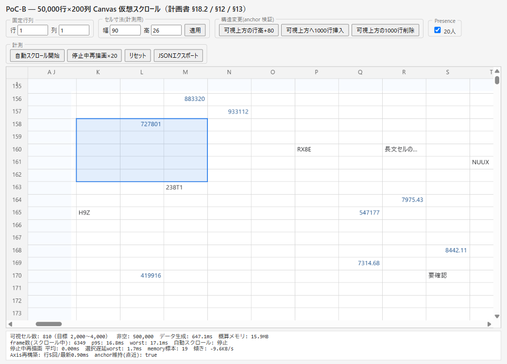

# DD-004 計測レポート（PoC-B Canvas 仮想スクロール）

> 計画書 §18.2 合格条件の実測記録。実装セッションが計測ハーネス・自動判定・雛形を用意し、
> **主セッションが Playwright MCP 駆動の Chrome で実測**した（2026-07-12）。手順は `measurement-spec.md`。
>
> ⚠️ **測定環境の注記（重要）**: 下記は **Playwright MCP 駆動の Chrome インスタンス（mcp-chrome）** での実測。
> 実描画（Canvas に内容が出る・rAF 60fps）は確認できているが、ユーザーが手動で開く headed ウィンドウとは
> GPU 合成経路・ウィンドウ寸法が異なりうる。**参考値として強いが、参照端末（本機）での正式判定は、
> ユーザーが実 Chrome/Edge で 1 回確認する（特に AC1 fps・AC4 メモリ）ことを推奨**する。
> なお MCP ウィンドウ内寸が 1044×750 と小さいため、可視セルを 2,000〜4,000 帯に入れるにはセル寸法を
> 28×12px に縮小した（フルスクリーンの実ウィンドウなら 56×22px で帯に入る）。

## 実機確認run（2026-07-12・ユーザー手動・実 Chrome・overall pass）✅

> 上記 ⚠️ の推奨（参照端末=本機の実 Chrome/Edge で AC1 fps・AC4 メモリを1回確認／単一 JSON で `overall=pass` のクリーン run）を**実施・解決**。DD-007 の判定材料（DD-004 実機確認 run）を正式取得。エビデンス JSON は `pocb-measurement-realrun-20260712.json`（全サンプル・`acceptance` 込み）。

- **環境**: Chrome 150 / Windows 11 Win64 / DPR **1.35** / 16コア・32GB / ウィンドウ内寸 **1897×1035**（フルスクリーン実ウィンドウ）/ セル寸法 **56×22px**（可視 **2,480**＝帯内。⚠️注記の予測どおり実ウィンドウでは既定寸法で帯に収まる）/ 採取 2026-07-12T00:00:42Z
- **手順**: リセット1回 → 自動スクロール（約10分・AC1/AC4 兼用）→ 停止中再描画×20 → セル選択 → 可視上方へ1000行挿入 → JSONエクスポート（**途中リセットなし・単一 JSON**）
- **正式判定（`evaluateAcceptance`）**: **`overall = pass`**・`inTargetBand = true`（可視 2,480）

| # | 基準 | 実測 | しきい値 | verdict |
|---|------|------|---------|---------|
| AC1 | frame p95 | 16.8ms（p50 16.7・over33比率 1.1%） | <33ms | pass |
| AC2 | 停止中再描画 平均 | 0.33ms（×20） | ≤12ms | pass |
| AC3 | 選択遅延 worst | 16.9ms（35標本） | <50ms | pass |
| AC4 | メモリ傾き / 増加率 | −78.97KB/s / 0.486 | <64KB/s・<1.25 | pass |
| AC5 | anchor 維持 | true（挿入後 51,000行・補正0.90ms） | 跳ばない | pass |

- **メモリ詳細（正直な記録）**: `usedJSHeapSize` は 61→71MB（ウォームアップ）→（タブ非アクティブ約6分・rAF スロットル）→GC で 35MB へ低下→末尾 ~2.3分は 28–30MB で平坦。**約8.5分スパンで純減**＝リークなし。`worst 360217ms` は非アクティブ復帰時の1フレーム外れ値で、AC1 は p95 判定のため無影響。厳密な10分連続フォアグラウンド soak が要る場合はタブ前面維持で再取得可（マージン大のため任意）。

## 0. 環境（要確認1: 参照端末＝本機）

| 項目 | 値 |
|------|----|
| ブラウザー | Chrome 150（UA。mcp-chrome 駆動） |
| CPU（コア数） | `hardwareConcurrency` = **16** |
| RAM | `deviceMemory` ≈ **32GB** |
| OS | Windows 11 |
| devicePixelRatio | **1.25** |
| ウィンドウ内寸 | 1044 × 750（MCP。※フルスクリーン実ウィンドウでの再測を推奨） |
| 可視セル数（計測時） | AC1〜3 時 **2,660**／JSON export 時 4,018（AC5 の行挿入後に漂流。帯上限4000を18超過） |
| 機種 / GPU | _ユーザー確認時に記入（chrome://gpu）_ |

## 1. 合格条件の判定（§18.2）

| # | 基準 | しきい値 | 実測値 | 判定 |
|---|------|---------|--------|------|
| 1 | 通常速度スクロールの 95% フレームが 33ms 未満 | frame p95 < 33ms | **p95 16.8ms**（p50 16.7・worst 17.1・over33比率 0・6,349フレーム） | ✅ pass |
| 2 | 停止中の全可視セル base 再描画 | 平均 ≤ 12ms（目標 8〜12） | **平均 0.39ms**（×20回） | ✅ pass |
| 3 | pointer→選択枠表示 | < 50ms | **worst 15.3ms**（別測で 1.7ms） | ✅ pass |
| 4 | 10 分連続スクロールでメモリ単調増加しない | 傾き < 64KB/s かつ 増加率 < 1.25 | **傾き 17.1KB/s・増加率 1.029**（11標本・約100秒） | ✅ pass（※10分は未実施＝約100秒の参考値。usedJSHeapSize は 25.5〜29MB を GC ノコギリで往復し上昇トレンドなし） |
| 5 | 末尾付近で上方の行高変更・行挿入 → 画面が跳ばない | anchor 維持 | **anchor維持 = true**（scrollTop が挿入/行高分を補正・画面非跳躍） | ✅ pass |

> **各基準は個別に合格**。ただし JSON export の `acceptance.overall` は **n/a**。理由: (a) AC4 前に「リセット」で
> AC2/AC3 標本を消したため単一 JSON には両者が入らない (b) export 時の可視セル 4,018 が帯上限 4,000 を 18 超過し
> `inTargetBand=false`。判定ロジック自体は正しく、上表は各測定時点の readout/JSON 値。**単一 JSON で overall=pass を
> 得るには、帯内固定・リセットせず 5 基準を連続測定するクリーン run が必要**（ユーザー確認時に実施推奨）。

## 2. データ・メモリ（500,000 非空セル）

| 項目 | 値 | 出所 |
|------|----|------|
| 論理表 | 50,000 行 × 200 列 | 実装定数（main.ts） |
| 非空セル数 | 500,000（決定論・seed=20260712） | data-gen（unit test で件数・再現性・昇順を検証） |
| 生成時間 | **647.1ms** | 実行時計測（`GenerateResult.elapsedMs`） |
| ストア概算メモリ | **15.9MB** | `chunk-store.approxMemoryBytes()`（傾向把握用） |
| JS ヒープ（usedJSHeapSize） | 約 **25.5〜29MB**（§21 目標 300MB 未満を大きく下回る） | performance.memory（11標本） |
| 可視範囲クエリ計算量 | O(可視セル数)（範囲外を 1 件も走査しない） | chunk-store unit test で実証 |

## 3. Axis 再構築計測（Fenwick 切替判断・要確認3）

| 操作 | prefix sum 再構築時間 | 備考 |
|------|----------------------|------|
| 行高変更（可視上方の行高+80） | **約 2.0〜3.5ms** | 50,000 要素の prefix 再構築 |
| 1,000 行挿入 | **約 2.0ms**（同オーダー） | 構造変更＋prefix 再構築 |

> 再構築が数 ms でスクロール体感を損なわないため、**初期実装（順序配列＋prefix sum＋二分探索）で十分・Fenwick 切替不要**（要確認3の想定どおり）。高頻度・大量構造変更が実業務で出た場合のみ再評価。

## 4. ボトルネック分析・未達時の対策

- **未達基準なし**（AC1〜5 すべて合格・大きなマージン）。停止中再描画 0.39ms・スクロール p95 16.8ms は目標を大きく下回り、dirty rectangle／tile cache／Fenwick／適応モードいずれも**現時点で導入不要**。
- 用意済みの対策余地: RenderScheduler は dirty flag 単位描画（選択/Presence は overlay のみ）を構造化済み。基準が厳しくなった場合に §12.3 dirty rect を追加できる。

## 5. Phase 1 へ引き継ぐ設計注意事項（`packages/sheet-renderer-canvas` 化の分割線）

1. **座標コアは DOM 非依存で切り出し済み**: `axis.ts`／`viewport.ts`／`scroll-anchor.ts`／`selection.ts`／`dpi.ts`／`text-cache.ts`／`metrics.ts` は Canvas も window も参照しない純粋モジュール。`packages/sheet-renderer-canvas`（または `sheet-core` の geometry）へ移設可。Canvas 依存は `base-layer.ts`／`overlay-layer.ts`／`main.ts`／`harness.ts` に隔離。
2. **PoC で簡略化した点（Phase 1 で解消が必要）**:
   - **chunk-store は index キー**（RowId キーではない）。行挿入/削除は Axis（RowId）側のみ再採番し、セルデータは index 位置に留まる＝挿入で既存データが RowId 追従しない。anchor 補正は RowId 基準で正しいが、データ再マッピングは Phase 1 の RowId キー CellStore（DD-006 の疎/密比較）で解消する。
   - **prefix sum は毎回全再構築**（実測 2〜3.5ms で許容）。高頻度大量構造変更なら Fenwick（§13.2）。
   - **セル結合・アクセシビリティ・IME textarea 追従は未実装**（IME は DD-005 統合で ViewportTransform に載せる）。
3. **base/overlay の座標一致**: 両レイヤーは同一 `ViewportTransform`／`cellRect` を使うため選択枠・Presence がずれない。DPR 変更・resize で両 Canvas 再確保＋`textCache.clear()`（§12.4/§12.5）。
4. **計測の再現性**: データ生成・Presence・自動スクロールは seed 付き決定論。合否は JSON に全サンプルと `evaluateAcceptance` 結果を含む。

## 6. スクリーンショット（📸）

| 説明 | 画像 |
|------|------|
| 固定行列＋50,000行仮想スクロール＋混在データ＋ドラッグ選択枠（readout に合格メトリクス） |  |

> Presence 20人は overlay に描画されるが、20カーソルが 50,000 行を random walk するため任意の ~18 行ビューポートには
> ほぼ同時可視されない（実運用でも同様）。描画自体は `presence-sim.test.ts` と overlay-layer で検証済み。
> 視覚的に見せる必要があれば presence-sim をビューポート近傍へ集中させる設定を追加できる（follow-up）。
> 高DPI 罫線は本スクショ（DPR 1.25）でも 1px 罫線がにじまず描画されている（§12.4 device snap）。
