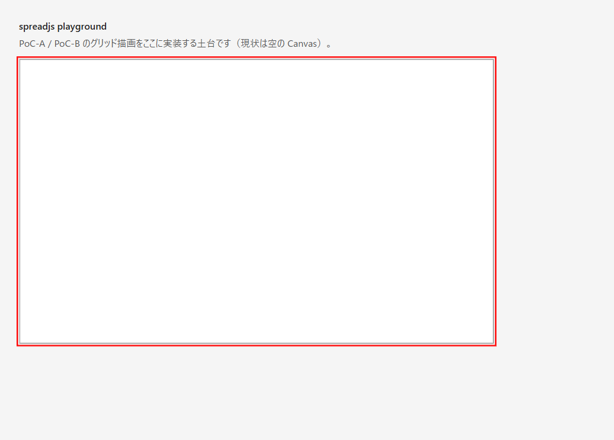

# DD-001: 開発基盤monorepo構築

| 作成日 | 更新日 | ステータス | 補足 |
|--------|--------|-----------|------|
| 2026-07-11 | 2026-07-11 | 完了 | npm workspaces基盤（sheet-types+playground）構築。dev/test/typecheck/lint整備、D-001/D-002記録 |

> アプローチ: 標準（基盤構築であり、画面・ビジネスロジックの検証は後続PoC DDで行うため）

## 目的

npm workspaces による monorepo 骨格（`packages/` と `apps/`）と、`npm run dev|test|typecheck|lint` が動く最小の開発基盤を構築する。以降の PoC-A〜D（IME / Canvas / 共同編集 / データ表現）のDDはすべてこの基盤の上で実装する。

## 背景・課題

- 計画書（`doc/plan/nanairo_realtime_spreadsheet_development_plan_v1.md` §17・§26-1）は monorepo と package boundary の作成を最初の作業と定めているが、現状はドキュメントのみで `packages/` も npm scripts も存在しない。
- AGENTS.md「コマンド」節に「ビルド／テスト系は monorepo 未構築のため未整備。Phase 0 で `packages/` を作成する際に定義する」と明記されており、本DDがその定義を行う。
- 計画書 §1.2 の暫定仮定 A-01（デスクトップのみ）・A-02（Win11 Chrome/Edge最優先）と §24 D-01（対応OS/ブラウザー）は確定期限が「Phase 0開始前」＝本DD着手前であり、確定記録が必要。

## 検討内容

- **パッケージマネージャ**: npm workspaces（追加ツール不要・Node同梱・計画書/AGENTS.mdのnpm前提と一致）を提案。pnpm は厳密な依存分離と速度で優るが、現段階はパッケージ2個で恩恵が小さい。turborepo/nx 等のタスクランナーも現段階では不要（パッケージが増えた時点で別DDで再検討）。
- **TypeScript設定共有**: ルート `tsconfig.base.json` に strict 共通設定を置き、各 workspace が extends する。§17.2「coreにDOM型を持ち込まない」に従い、base には DOM lib を含めず `sheet-types` は `lib: ["ES2022"]` のみでコンパイルする。DOM が必要な `apps/playground` 側だけ lib に DOM を追加する。
- **テストランナー**: vitest（Vite と設定共有でき、TS を直接実行できる）。計画書にランナー指定はない。
- **lint**: ESLint flat config + typescript-eslint recommended。§17.2 の package boundary lint は本DDでは導入せず、パッケージが増える PoC-C 以降で別途検討（本DDは基本設定まで）。
- **作らないもの**: 本DDでは製品ロジック（グリッド描画・IME処理・サーバー）・CI・他の packages（sheet-core 等）は作らない。計画書 §17.1 の全体構成は目標にとどめ、最小骨格（sheet-types + playground）のみ作る。

## 決定事項

- monorepo は **npm workspaces**（`packages/*` + `apps/*`）で構成する（要確認2）。
- **Node.js 22 を基準**とする（実行環境 v22.20.0 / npm 10.9.3 を確認済み。ルート package.json に `engines.node: ">=22"` を明記）（要確認3）。
- packages/* は**ランタイム依存ゼロ**（計画書 §3.6・ADR-022）。dev 依存（vite / vitest / eslint / typescript 等)のみ許可し、ルートに集約する。
- パッケージ名は `@spreadjs/*` スコープを暫定採用（npm 公開時に再検討。decisions.md には昇格しない）。
- A-01/A-02/D-01 は推奨案どおり確定し、`doc/decisions.md` へ記録する（要確認1。**ユーザー承認後に** Phase 3 で記録）。

### 要確認（ユーザー判断が必要）

1. **要確認**: A-01（初期対象はデスクトップブラウザーのみ）・A-02（Win11 Chrome/Edge 最優先、Firefox・macOS Chrome/Safari 次順位）・D-01（対応OS/ブラウザー）を計画書の推奨案どおり確定してよいか。
2. **要確認**: パッケージマネージャは npm workspaces でよいか（pnpm 等の希望はないか）。
3. **要確認**: Node.js の対象バージョンは 22 基準（`engines: ">=22"`）でよいか（実行環境は v22.20.0）。

## 受け入れ基準

| # | 基準（操作 → 期待結果） | 検証方法 |
|---|------------------------|---------|
| 1 | `npm install` → exit 0、続けて `npm run dev` → playground が起動しブラウザーに空のCanvasが表示される | Phase 1 🔬 + エビデンス |
| 2 | `npm run test` → sheet-types のユニットテスト1本以上が pass | Phase 2 🔬 |
| 3 | `npm run typecheck` → エラー0（sheet-types は DOM lib なしで型検査が通る） | Phase 2 🔬 |
| 4 | `npm run lint` → エラー0 | Phase 2 🔬 |
| 5 | `packages/sheet-types/package.json` に `dependencies` が存在しない（ランタイム依存ゼロ） | Phase 2 🔬 |
| 6 | AGENTS.md「コマンド」表が実コマンドに更新され、`bash scripts/doc-check.sh` → エラー0 | Phase 3 🔬 |
| 7 | `doc/decisions.md` に A-01/A-02/D-01 の確定が記録されている（ユーザー承認後） | Phase 3 タスク + 🔬 |

## タスク一覧

### Phase 0: 事前精査
- [x] 📋 **各Phaseのタスク精査・詳細化** — 受け入れ基準7項目はすべて「操作→期待結果」で記述され、各項目に検証方法（🔬機械検証タスク）が対応。各タスクに対象ファイルパスと変更内容が明記済み。各Phaseに🔬機械検証タスクあり。精査で不足なし。
- [x] 📐 **実装前詳細化トリガー判定**
  - **判定結果: Phase 1 → 詳細化要 / Phase 2 → 不要 / Phase 3 → 不要**。Phase 1 は新規モジュール追加・3ファイル超で「詳細化要」。ただし全ファイルが新規かつ本文タスクにパス単位で具体化済みで、workspace 構成・tsconfig 継承・パッケージ間参照方法は Phase 1 冒頭タスクで箇条書き化した（ログ参照）。その内容は仕様確認ゲートで合意済みの決定（npm workspaces / Node22 / DOM分離）の範囲内のため、追加のユーザーレビューは不要と判断し実装を継続した。
- [x] 🧑‍⚖️ **Codexレビュー要否判定**
  - **判定結果: Phase 3 → 推奨・effort: high**。必須シグナル該当なし（API/DB/認可/データ移行/並行処理なし）、3ファイル以上の新規変更に該当し「推奨」。effort は既定 high（xhigh のトリガー〔ユーザー明示指示・複合必須シグナル〕に非該当）。基準: `doc/templates/guides.md` §Codexレビューゲート。
- [x] 😈 **Devil's Advocate調査**
  - 欠点・リスク: npm workspaces のフラットな node_modules は幽霊依存を許す → 受け入れ基準#5 と Phase 2 の🔬機械検証（`dependencies` キー数=0）で `sheet-types` のランタイム依存ゼロを機械的に担保。
  - 他の選択肢: pnpm（厳密な依存分離）/ tsc project references（増分ビルド）→ 現段階は2パッケージで恩恵が小さく、npm workspaces で十分。パッケージ増加時に別DDで再検討（decisions.md D-002 に帰結を記録）。
  - 将来の壊れやすさ: (a) パッケージ追加時の tsconfig/eslint コピペ増殖 → `tsconfig.base.json` extends で共通化済み（lib のみ各自上書き）。(b) package boundary lint 不在 → PoC-C 以降で導入予定と本文に明記。(c) base に lib を置かない方針は、新パッケージが lib 追加を忘れるとグローバル型が空になり気づける（むしろ安全側）。

### Phase 1: monorepo骨格（workspaces・sheet-types・playground）
- [x] 📐 **実装前詳細化**（Phase 0 で「詳細化要」）: 下記を箇条書き化。仕様確認ゲート合意済みの決定範囲内のため追加ユーザーレビューは不要と判断し実装継続（Phase 0判定参照）。
  - workspace 構成: ルート `workspaces: ["packages/*","apps/*"]`。`packages/sheet-types`（型パッケージ・依存ゼロ）と `apps/playground`（Vite アプリ）の2つ。
  - tsconfig 継承: ルート `tsconfig.base.json`（strict 群・**lib 無し**）を各 workspace が extends。`sheet-types` は `lib:["ES2022"]`＋`types:[]`、`playground` は `lib:["ES2022","DOM","DOM.Iterable"]`＋`types:[]`。
  - パッケージ間参照: playground が devDep `"@spreadjs/sheet-types":"*"`（npm workspaces symlink）。`sheet-types` は `exports/types` を `./src/index.ts` にしソース直参照（Vite/tsc bundler resolution）。ビルド成果物は介さない。
- [x] `package.json`（ルート・新規）: `private: true`、`workspaces: ["packages/*", "apps/*"]`、`engines.node: ">=22"`、scripts（`dev` / `build` / `test` / `typecheck` / `lint`）を定義。dev 依存（eslint/@eslint/js/typescript/typescript-eslint/vitest）と `overrides.vite` を集約。
- [x] `.gitignore`（ルート・新規）: `node_modules/`・`dist/`・`*.tsbuildinfo`・`.vite/`・`coverage/` 等を除外
- [x] `tsconfig.base.json`（ルート・新規）: `strict: true` ほか厳格設定・target/module ES2022 系（bundler resolution）・**DOM lib を含めない**共通設定
- [x] `packages/sheet-types/package.json`（新規）: name `@spreadjs/sheet-types`・`type: "module"`・`exports`/`types` は `./src/index.ts`・`dependencies` なし
- [x] `packages/sheet-types/tsconfig.json`（新規）: base を extends し `lib: ["ES2022"]`・`types: []`（DOM/Node なし）
- [x] `packages/sheet-types/src/ids.ts`（新規）: 計画書 §6.1 のブランド型6種（`DocumentId` / `SheetId` / `RowId` / `ColumnId` / `OperationId` / `TransactionId`）と最小のファクトリ関数（文字列 → ブランド型。ID生成ロジックは PoC の DD で扱う）
- [x] `packages/sheet-types/src/index.ts`（新規）: 公開エントリ（ids の re-export のみ）
- [x] `apps/playground/package.json`（新規）: devDeps に vite、`@spreadjs/sheet-types` を workspace 参照
- [x] `apps/playground/tsconfig.json`（新規）: base を extends し lib に DOM / DOM.Iterable を追加
- [x] `apps/playground/index.html` + `apps/playground/src/main.ts`（新規）: 枠線付きの空 `<canvas>` を1枚表示する土台（描画ロジックなし。PoC-A/B の実装先）。sheet-types の `createDocumentId`/`DocumentId` を import・使用して workspace 参照が機能することを示す
- [x] 🔬 **機械検証**: `npm install` → exit 0 ✅ / `npm run dev` → Vite v6.4.3 が `http://localhost:5177/` で ready、`/` が HTTP 200・`/src/main.ts` が 200 で `@spreadjs/sheet-types` を解決（バックグラウンド起動→curl確認→停止で検証。ブラウザー目視は下記📸へ）
- [x] 📸 **エビデンス**: playground の空Canvas表示のキャプチャ（`DD-001/playground-after-empty-canvas.png`）→ 主セッションの Playwright MCP で取得済み（Canvasを赤枠ハイライト。エビデンス欄参照）
- [x] 😈 **DA批判レビュー（「このPhaseで何が壊れるか」を探す。基準: da-method.md §3.4）** → DA記録へ

### Phase 2: テスト・型検査・lint整備
- [x] `package.json`（ルート）: devDeps に typescript `^5.7.2`（実 5.9.3）/ vitest `^3.0.0`（実 3.2.7）/ eslint `^9.17.0`（実 9.39.5）/ @eslint/js / typescript-eslint `^8.18.1`（実 8.63.0）を追加。vite は `overrides` で 6.4.3 に統一（重複解消 + esbuild dev脆弱性回避 → `npm audit` 0件）
- [x] `packages/sheet-types/src/ids.test.ts`（新規）: ファクトリの最小ユニットテスト3本（値の保持・異なる入力→異なる値・戻り値が対応ブランド型として扱える〔型注釈で担保、壊れると typecheck が失敗〕）
- [x] `eslint.config.js`（ルート・新規）: typescript-eslint recommended ベースの flat config（対象: `**/*.ts`＝`packages/**`・`apps/**`。TS が担保する `no-undef` は無効化）
- [x] ルート scripts 配線: `npm run test` → `vitest run` / `npm run typecheck` → `npm run typecheck --workspaces --if-present`（各 workspace `tsc --noEmit`） / `npm run lint` → `eslint .`
- [x] 🔬 **機械検証**: `npm run test` → 3 tests pass ✅ / `npm run typecheck` → エラー0 ✅ / `npm run lint` → エラー0 ✅
- [x] 🔬 **機械検証（依存ゼロ）**: `node -p "Object.keys(require('./packages/sheet-types/package.json').dependencies ?? {}).length"` → `0` ✅
- [x] 😈 **DA批判レビュー（「このPhaseで何が壊れるか」を探す。基準: da-method.md §3.4）** → DA記録へ

### Phase 3: ドキュメント整合と決定記録
- [x] `AGENTS.md`: 「コマンド」節の未整備注記を削除し、`npm install|run dev|build|test|typecheck|lint` + ドキュメント系スクリプトの実コマンド表に更新。冒頭ステータスを「Phase 0 進行中（DD-001 で基盤構築済み）」に更新
- [x] `README.md`: ステータス注記を「Phase 0 進行中（開発基盤を構築済み）」に更新し、「想定モジュール構成」は目標構成で現状は sheet-types + playground のみ実在する旨を明記
- [x] `doc/decisions.md`: 雛形 D-001 プレースホルダーを実決定で置換 — D-001: 初期対象プラットフォーム（A-01/A-02/D-01 を統合。デスクトップブラウザーのみ・Win11 Chrome/Edge 最優先・Firefox / macOS 次順位）、D-002: monorepo は npm workspaces + Node 22 基準（ユーザー承認済み。元DD: DD-001）
- [x] `doc/DOC-MAP.md`: doc/ 配下に**新規ドキュメントの追加なし**（codex-review 依頼書/結果は `doc/DD/DD-001/` 配下で doc-check の索引対象外）→ 更新不要を確認
- [x] 🔬 **機械検証**: `bash scripts/doc-check.sh` → エラー0（DOC-MAP 孤児・リンク切れなし）✅
- [x] 😈 **DA批判レビュー（「このPhaseで何が壊れるか」を探す。基準: da-method.md §3.4）** → DA記録へ
- [x] Codexレビュー自動実行（未コミット全差分を対象に依頼書 `DD-001/codex-review-request.md` 生成 → `bash scripts/codex-review.sh --uncommitted` → 結果を `DD-001/codex-review-result.md` に保存。effort: high）
- [x] Codexレビュー指摘への対応、または見送り理由をログに記録 → ログ「Codexレビュー対応」参照

## エビデンス

| After |
|-------|
|  |
| ✅ `npm run dev` で playground が起動し、枠線付きの空Canvas（赤枠ハイライト）が表示される（受け入れ基準 #1） |

## ログ

### 2026-07-11
- DD作成（`doc/plan/phase0-dd-roadmap.md` の①「開発基盤（monorepo）構築」に対応。同ロードマップの実DD列に DD-001 を記入）
- Codex CLI 利用可否チェック: 利用可（codex-cli 0.144.0-alpha.4）→ Codexレビュータスクを Phase 3 末尾に配置。起票時暫定判定: 推奨・effort high
- Playwright MCP: 起票エージェントからは利用可否を確認できず。実装Phase開始時に確認し、利用不可ならエビデンスは手動キャプチャで代替
- 実行環境確認: Node v22.20.0 / npm 10.9.3（Node 対象バージョン提案の根拠）
- 要確認: A-01/A-02/D-01 を計画書の推奨案どおり確定してよいか（決定事項 §要確認1）
- 要確認: パッケージマネージャは npm workspaces でよいか。pnpm 等の希望はないか（同 §要確認2）
- 要確認: Node.js 対象バージョンは 22 基準（engines ">=22"）でよいか（同 §要確認3）

### 2026-07-11（実装 + Codexレビュー / Opus）

- **仕様確認ゲート合意を反映**: 要確認1〜3 はすべて推奨案どおり確定（デスクトップのみ・Win11 Chrome/Edge 最優先 / npm workspaces / Node 22 基準）。decisions.md 記録の承認も取得済みとして Phase 3 で記録。DD本文との食い違いなし。
- **実装（Phase 1〜3）**:
  - ルート: `package.json`（npm workspaces `packages/*`+`apps/*`、`engines.node:">=22"`、scripts dev/build/test/typecheck/lint、dev依存はルート集約、`overrides.vite:"^6.4.3"`）、`.gitignore`、`tsconfig.base.json`（strict群・**lib無し**・bundler resolution・verbatimModuleSyntax 等）、`eslint.config.js`（flat / typescript-eslint recommended）、`vitest.config.ts`（node環境）。
  - `packages/sheet-types`: `package.json`（`exports`/`types`→`./src/index.ts`・依存ゼロ）、`tsconfig.json`（`lib:["ES2022"]`+`types:[]`）、`src/ids.ts`（§6.1 ブランド型6種+ファクトリ）、`src/index.ts`、`src/ids.test.ts`。
  - `apps/playground`: `package.json`（devDeps: vite・`@spreadjs/sheet-types:"*"`）、`tsconfig.json`（lib に DOM/DOM.Iterable）、`index.html`+`src/main.ts`（枠線付き空Canvas土台。sheet-types の型を import・使用）。
  - ドキュメント: AGENTS.md（ステータス・コマンド表）、README.md（ステータス・目標構成の注記）、decisions.md（D-001 プラットフォーム / D-002 monorepo方針）。
- **環境 / 依存解決**: Node v22.20.0 / npm 10.9.3。install 後の実効版: typescript 5.9.3 / vite 6.4.3（単一）/ vitest 3.2.7 / eslint 9.39.5 / typescript-eslint 8.63.0。`npm audit` **0件**（当初 vite 5↔6 重複＋esbuild の dev-only 脆弱性 → `overrides.vite ^6.4.3` で単一化して解消）。
- **機械検証（受け入れ基準）**: #1 install=exit0 / dev=Vite v6.4.3 が :5177 ready・`/`=200・`/src/main.ts`=200 で workspace import 解決（背景起動→curl→停止）。ブラウザー目視のみ**手動キャプチャ待ち**（Playwright MCP 不在）。#2 test=**4 pass** / #3 typecheck=**エラー0**（sheet-types は DOM lib なしで通過）/ #4 lint=**エラー0** / #5 依存ゼロ=`dependencies` キー数**0** / #6 `doc-check.sh`=**エラー0** / #7 decisions.md に D-001/D-002 記録。参考: `npm run build` 成功・bundle に workspace import 取り込みを確認。
- **Codexレビュー対応**（effort high・`--uncommitted`。結果: `DD-001/codex-review-result.md`）:
  - findings **1件（P2/中）**: ブランド型の区別テストが「同一ブランドへの正常代入」しか見ておらず、ブランドが素の string へ退化 or 別ブランドと同一化しても typecheck が通る／残り3ファクトリの戻り型が未検証。
  - 対応 **✅修正**: `ids.test.ts` に vitest `expectTypeOf` の**型レベル負テスト**を追加。6種すべてが `string` と非同一・異なるブランド同士が相互に区別されることを表明し、区別が壊れると `npm run typecheck` が失敗する（退化を模した一時ファイルで tsc エラーを実証してから削除）。`@ts-expect-error` は使わず purpose-built の表明で担保（規約 P19 回避）。修正後も test 4 pass / typecheck 0 / lint 0。見送った指摘: なし。
- **未解決 / 要判断**: なし（設計はユーザー合意の範囲内で完結）。残タスクは 📸 空Canvas目視の手動キャプチャのみ（Playwright MCP がツールに無いため実装側では取得不可）。

### 2026-07-11（エビデンス取得・最終検証 / 主セッション）
- 主セッションで typecheck / test / lint を再実行し green を再確認（typecheck エラー0・4 tests pass・lint エラー0）
- Playwright MCP で playground（`npm run dev` → :5174）を開き、Canvasを赤枠ハイライトして `DD-001/playground-after-empty-canvas.png` を取得 → 📸タスク完了（受け入れ基準 #1 の目視分を充足）
- ブラウザーコンソール: `favicon.ico` の404が1件のみ（favicon未設定のplaygroundでは想定内のノイズ。機能影響なし）。JSエラーなし
- 全タスク完了。ステータス「確認待ち」＝ユーザーレビューとコミット判断待ち

### 2026-07-11（クローズ）
- ユーザー承認 → コミット e17dfac（`DD-001: 開発基盤monorepo構築`）→ ステータス「完了」へ更新しアーカイブ
- 仕様書同期チェック: 対象なし（`doc/spec/` は未作成・本DDは画面/API/DBの仕様変更を含まない基盤構築のため）
- 知見の昇格判定: 長寿命の決定は実装時に `doc/decisions.md` D-001/D-002 へ記録済み。横断gotcha（幽霊依存対策・DOM lib分離等）はDD本文のDA記録と decisions.md でカバーされるため engineering-patterns.md への追加なしと判断

---

## DA批判レビュー記録

> 手順・品質フィルター・再チェック条件は `doc/da-method.md` を参照。

### Phase 1〜3 DA批判レビュー（統合）

**DA観点:** この基盤で最も壊れやすいのは「DOM/依存の分離が崩れる」「ドキュメントと実装が乖離する」の2点。

| # | Phase | 発見した問題/改善点 | 重要度 | 再現手順（高/中は必須） | DA観点 | 対応 |
|---|-------|-------------------|--------|----------------------|--------|------|
| 1 | 2 | ブランド型の区別テストが型注釈のみで、ブランドが素の string へ退化 or 別ブランドと同一化しても `npm run typecheck` が成功してしまう（Codex も同一指摘） | 中 | ids.ts の RowId を `string` に退化 → typecheck 成功（区別喪失を検出できない） | テスト不足 | ✅修正済（`expectTypeOf` の型レベル負テストで、退化・同一化時に typecheck が失敗するよう担保。一時ファイルで tsc エラーを実証） |
| 2 | 2 | packages/* のランタイム依存ゼロを人手だけで守ると幽霊依存で崩れやすい | 中 | packages/sheet-types に誤って `dependencies` を追加してもローカルは動く | 不変条件の破れ | ✅修正済（受け入れ#5＋🔬 `dependencies` キー数=0 の機械検証で担保。CI 化は PoC-C 以降） |
| 3 | 3 | AGENTS.md/README のコマンド表が実 scripts と乖離しうる（doc-check は表の実在までは検証しない） | 中 | scripts を変更し表を更新し忘れる → doc-check は通るが表が古いまま | 回帰/整合 | ❌不要（今回は scripts と一致。コマンド変更時は手動同期が必要という残リスクは受容。ボイラープレート増時に別途検討） |
| 4 | 1 | base に lib を置かない設計で、新 workspace が lib 追加を忘れるとグローバル型が欠落する | 低 | 新 package の tsconfig で lib 未指定 → 必要グローバルが未定義エラー | 設定の抜け漏れ | ❌不要（むしろ安全側＝忘れたら typecheck が即落ちて気づく。base に DOM を入れて sheet-types の DOM 混入を見逃す方が有害） |
| 5 | 1 | `exports`/`types` を `.ts` ソース直参照にしているため、将来 sheet-types を成果物として外部公開する際に解決方式の変更が要る | 低 | 外部公開時に `.d.ts`/`dist` へ切替が必要 | 将来の壊れやすさ | ⏭️別DD（現状 `private:true` で内部限定。公開はスコープ外） |
