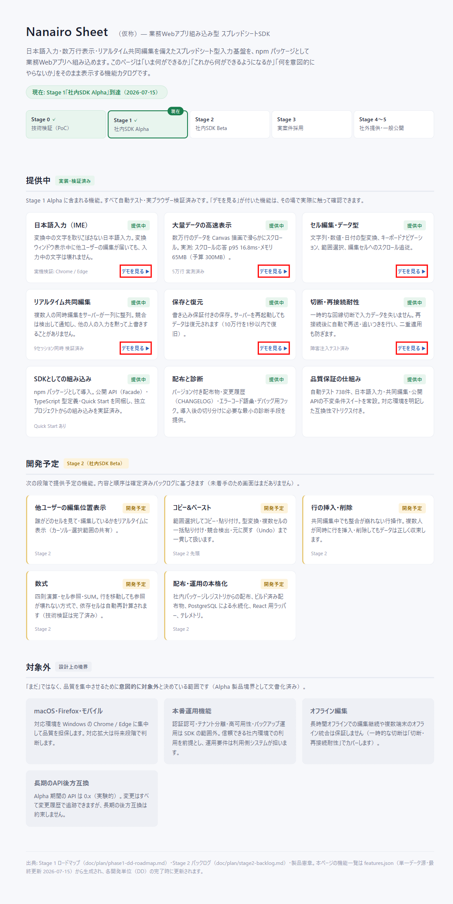
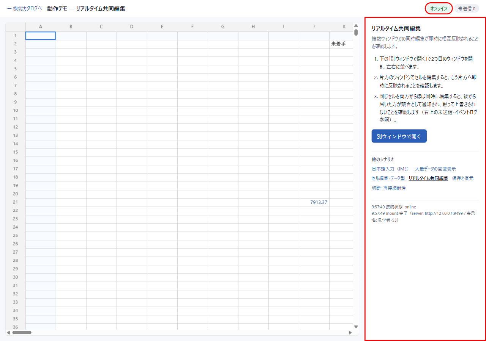

# DD-017-2: SDK紹介サイト・機能カタログ（showcase）

| 作成日 | 更新日 | ステータス | 補足 |
|--------|--------|-----------|------|
| 2026-07-15 | 2026-07-15 | 完了 | 紹介サイト＋動作デモ6シナリオ（apps/showcase・Facade のみ・boundary baseline追加0）。features.json 一元化＋更新義務を AGENTS.md へ常設・dev-start --showcase 統合・5分デモ台本。全🔬green（744 test・e2e 3本・起動200）・Codex medium P2×2 全反映・見送り0。AC1〜7 充足・ユーザー承認 2026-07-15 |

```text
Risk Class: B
Risk Triggers: なし（コア・protocol・永続化・公開API無改変。新規 app＋doc のみ）
Human Spec Gate: required（想定外DD＝承認済みバックログ外。Phase 1 モックレビューをゲートとする）
Codex: medium（UI/doc 中心・コア無改変＝roadmap §2.2 L3「UI/doc=medium」。対象は Phase 2/3 実装差分）
Manual Gate: あり（画面Phase＝スクリーンショットエビデンス＋実ブラウザー起動確認。Tier-1 実機再ゲートは不要＝コア無改変・全CG終端済み）
External Review: なし
Evidence Level: standard
```

> アプローチ: モック先行（画面新規作成のため・ユーザー指定 2026-07-15）
> 親: DD-017（Alpha配布・診断）— 「配布物を見せられる形にする」の延長。採番はロードマップ §0 の子DD方式（DD-019〜022 は Stage 2 予約済みのため使用しない）

## 目的

SDK という提供形態は完成度が外部から見えない。**全機能（実装済み＋今後実装予定）を1画面で紹介する紹介サイト（機能カタログ）**と、そこから遷移できる**動作確認デモ（showcase）**を常設し、DEV サーバー起動ひとつで「現在の進捗と今後の見通し」を外部（上司・ステークホルダー・導入候補プロジェクト）が把握できる状態にする。

## 背景・課題

- Stage 1 Alpha 到達（DD-018・2026-07-15）済みだが、成果が DD 文書・テストログの形でしか存在せず、非開発者に伝わらない。
- ユーザー提案（2026-07-15）: ①紹介サイト HTML の構成を計画（今後実装する機能も全部紹介する想定）②未実装箇所は概要のみ記載 ③モックをまず作る。
- 補強合意: ステータスは「まだ」の一語でなく **提供中／開発予定／対象外の3区分**（roadmap §6 Alpha 製品境界の「やらない」を「まだ」と区別する）。機能一覧の二重正本化を防ぐため表示データを一元化する。

## 検討内容

- 機能一覧の情報源: roadmap §4（DD-009〜022）・`doc/plan/stage2-backlog.md`・製品憲章 §15／§6 製品境界。紹介サイトはこれらの**表示用写像**であり正本にしない（出典列で対応を維持）。
- playground（PoC 実装場・内部 import が boundary baseline に残る）と分離し、showcase は **Facade（`@nanairo-sheet/grid`／`server-hono`）経由のみ**で書く → 紹介サイト自体が公開 API のリグレッション検出網を兼ねる。
- 壊れたデモは無いより悪い → 起動＋主要導線を smoke で機械保証し、features データ更新を DD 完了時義務に載せる。

## 決定事項

> 起票時の方針。Phase 1 モックレビューで確定する。

- **D1: ステータス3区分** — `提供中`（実装・検証済み・デモリンク付き）／`開発予定`（Stage 2 バックログ確定済み・概要＋予定段階を記載）／`対象外`（製品境界＝意図的に外す。例: macOS/Firefox、本番認証・HA）。
- **D2: features データ一元化** — 機能×ステータス×概要×出典（DD/roadmap 参照）×デモリンクを `apps/showcase` 内の単一データ（features.json 等）に集約し HTML へ描画。**DD 完了時の features 更新**を AGENTS.md「ドキュメント更新義務」へ追記する。
- **D3: `apps/showcase` 新設・Facade 経由のみ** — boundary lint 対象化（baseline 追加 0）。playground は PoC 用に現状維持。
- **D4: スコープ凍結** — 見た目の作り込み・シナリオ追加は Stage 2 機能の実装時のみ。本 DD は Risk Class B〜C の範囲を維持し、膨らむ場合は子 DD へ分割。

### 要確認（確定済み 2026-07-15）

| # | 論点 | 確定 |
|---|------|--------|
| ① | 機能一覧の粒度・語彙 | **確定**: 利用者語彙を主・DD/CG 番号は出典として裏（title 属性/features.json source）に格納。モック承認（「モック完璧」）に含む |
| ② | 動作デモ配線のスコープ | **確定**: 提供中5シナリオ＋セル編集の計6デモを配線（分割不要の規模で収まった） |
| ③ | 起動方式 | **確定**: `dev-start.sh --showcase`（:5886＝5174+712）に統合（ユーザー提案 2026-07-15＝「製品用スクリプトに混ぜる」に合意）。`--server-only`／`dev-kill.sh --server` を復元・再接続デモ用に追加 |

### Phase 2 実装前詳細化の確定（D5〜D7）

- **D5 構成**: `apps/showcase`（Vite・playground と同型・realpath input 踏襲）。`index.html`＝カタログ（`src/features.json` から描画）／`demo.html`＝Facade `mount()` ライブデモ（シナリオパネル・接続状態/未送信表示・イベントログ）。features スキーマ＝`id/title/status/summary/source/meta?/demo?`
- **D6 永続化デモ**: `--showcase` は `PERSISTENCE_DIR=.dev-persistence/showcase`（.gitignore 追加）。シードは fresh 時のみ実行（DD-014/DD-018-1 実装済み挙動）＝再起動で復旧し「保存と復元」デモが成立
- **D7 腐り防止の機械化**: root `build` を `--workspaces --if-present` へ（showcase を既定 build ゲートに包含）。`features.test.ts`（`npm test` 包含）＋`test:e2e:showcase`（実ブラウザー smoke）を常設

## 受け入れ基準

| # | 基準（操作 → 期待結果） | 検証方法 |
|---|------------------------|---------|
| 1 | 紹介サイトが全機能を3区分で網羅（roadmap §4 DD-009〜022＋stage2-backlog＋§6 製品境界と過不足なし）。未実装機能にも概要が付く | Phase 1 突き合わせ表＋👀モックレビュー |
| 2 | HTMLモックをユーザーが確認し構成・区分に合意 | Phase 1 👀ユーザーレビュー（ゲート） |
| 3 | コマンド1つで紹介サイトが起動・閲覧できる | Phase 2 🔬（起動→HTTP 200＋📸スクショ） |
| 4 | 「提供中」機能の行から動作デモへ遷移し実際に操作できる | Phase 3 🔬（Playwright 導線確認＋📸） |
| 5 | ステータス表示は features データ1箇所の変更だけで反映される（HTML 手書き重複なし） | Phase 2 🔬（features 変更→表示反映の導通確認） |
| 6 | showcase は Facade 経由のみ（boundary lint green・baseline 追加 0） | Phase 2/3 🔬 `npm run lint:boundary` |
| 7 | 起動＋主要導線が smoke で機械保証される（壊れたデモ防止） | Phase 3 🔬 smoke green |

## タスク一覧

### Phase 0: 事前精査
- [x] 📋 各Phaseのタスク精査・詳細化（AC1〜7 それぞれに検証タスク対応済み・対象パス明記済み）
- [x] 📐 実装前詳細化トリガー判定 → **Phase 1 不要（doc/mock のみ）／Phase 2 要**（新規モジュール `apps/showcase` 追加＝規模シグナル該当。詳細化＝app 構成・features スキーマ・起動導線をモックレビュー通過後に実施）／Phase 3 不要（配線・doc 中心）
- [x] 🧑‍⚖️ Codexレビュー要否判定 = **推奨・medium**（画面新規・3ファイル以上。ただし UI/doc 中心・コア無改変ゆえ medium。対象 Phase 2/3 を束ねて1回。Codex 利用可確認済＝下記ログ）
- [x] 😈 Devil's Advocate調査 → ①陳腐化リスク: features 更新義務の設置が Phase 3 のため、それまでの Stage 2 着手で即古くなる → Phase 3 完了までは本DDが更新責任を持つ（ログ参照）②「対象外」の否定的印象 → 見出しを「設計上の境界」とし理由・代替を併記（モック反映済み）③playground との役割混同 → 紹介サイトに playground への導線を置かない・DOC-MAP で役割を明記（Phase 3）

### Phase 1: 機能カタログ定義＋HTMLモック作成
- [x] 機能カタログ表を作成（`doc/DD/DD-017-2/feature-catalog.md`）: roadmap §4・stage2-backlog・§6 製品境界から全機能を抽出し、3区分＋概要＋出典を付与（AC1 の突き合わせ表を兼ねる）
- [x] 🎨 HTMLモック作成（`doc/DD/DD-017-2/mock/index.html`）: 静的 HTML/CSS・依存ゼロ。Stage 進捗バー＋3区分（提供中=デモリンク付き／開発予定=概要のみ／対象外=境界と理由）＋モック注記バナー
- [x] 🔬 機械検証: grep 突き合わせ → **DD-009〜022 全番号＋stage2-backlog §2（レジストリ/ビルド済み/PostgreSQL/React/テレメトリ）＋§6 境界（macOS/オフライン/後方互換/認証認可）漏れ0**（AC1）
- [ ] 👀 **ユーザーレビュー**: モック＋カタログ＋要確認①〜③を提示し合意を得る（**合意後に Phase 2 へ**＝ゲート）

### Phase 2: apps/showcase 実装（紹介サイト本体）
- [x] 📐 実装前詳細化 → D5〜D7 に確定（app 構成・features スキーマ・起動導線）
- [x] `apps/showcase` 新設: 承認済みモックを実装（`index.html`＋`src/catalog/main.ts`＝features.json 描画・innerHTML 不使用）
- [x] `scripts/dev-start.sh`/`dev-kill.sh`: `--showcase`（:5886）・`--server-only`・`--server` 追加（既定動作は不変）
- [x] boundary lint: `apps/*` 自動対象（設定不要を確認）。Facade のみ import で **baseline 追加 0**（AC6）
- [x] 🔬 機械検証: `--showcase` 起動→showcase/health とも HTTP 200（AC3）・typecheck/eslint/lint:boundary（new=0）/build（workspaces 化）green ＋ 📸 スクショ
- [x] 😈 DA批判レビュー（下記記録）
- [x] Codexレビュー自動実行（medium・Phase 3 と束ねて1回）→ 結果 `DD-017-2/codex-review-result.md`

### Phase 3: 動作デモ配線・運用固定
- [x] デモ配線: `demo.html`＋`src/demo/main.ts`＋`scenarios.ts`（6シナリオ・Facade `mount()` のみ・接続状態/未送信/イベントログ表示・カタログ「デモを見る」から遷移）
- [x] smoke 追加: `src/features.test.ts`（vitest・`npm test` 包含＝カタログ整合性）＋`e2e/showcase.spec.ts`（`npm run test:e2e:showcase`＝起動・カタログ描画・デモ接続・全シナリオ表示）
- [x] `apps/showcase/README.md`: 起動手順＋5分デモ台本＋features.json 更新義務＋リセット手順
- [x] AGENTS.md（コマンド表2行・ドキュメント更新義務に features.json）＋`doc/DOC-MAP.md` 追記
- [x] 🔬 機械検証: vitest 744/744（既存738＋新規6・回帰0）・Playwright smoke 3/3 green（AC4/5/7）＋ 📸 スクショ
- [x] 😈 DA批判レビュー（下記記録）
- [x] Codexレビュー指摘への対応 or 見送り理由をログに記録

## エビデンス

| カタログ（提供中→デモ導線を赤枠） | デモ（オンライン接続・シナリオパネルを赤枠） |
|--------|-------|
|  |  |
| ✅ 3区分カタログ・Stage進捗バー・デモリンク6本 | ✅ 5万行シード接続「オンライン」・共同編集シナリオ・50k行グリッド描画 |

## ログ

### 2026-07-15
- DD作成（ユーザー提案: 紹介サイト最重要・全機能紹介・未実装は概要のみ・モック先行。補強合意: 3区分ステータス・features 一元化・showcase=Facade 経由）
- Codex 利用可確認済（`scripts/codex-review.sh --check` → codex-cli 0.144.2）
- Playwright MCP 利用可（画面 Phase のエビデンスは browser_take_screenshot で取得）
- Phase 0 完了: 詳細化判定（Phase 2 のみ要）・Codex=推奨 medium・DA 3所見（陳腐化/対象外の印象/playground 混同→いずれも対応方針確定）
- Phase 1 完了: feature-catalog.md＋mock/index.html 作成。🔬網羅性 grep 漏れ0。**陳腐化リスクの暫定措置: Phase 3 の features 更新義務設置まで、Stage 2 DD が先行着手された場合は本DDがカタログ更新の責任を持つ**
- ステータス 検討中→確認待ち（モックレビュー＋要確認①〜③の合意待ち）
- 👀 **モックレビュー通過**（ユーザー「モック完璧です」）＋要確認③確定（dev スクリプト統合はユーザー自身の提案と一致）→ Phase 2/3 続行
- Phase 2/3 完了: apps/showcase 実装・dev スクリプト統合・smoke 常設・README/AGENTS.md/DOC-MAP 更新。🔬全 green（typecheck／eslint／lint:boundary new=0／build／vitest 744/744／Playwright smoke 3/3／`--showcase` 起動 HTTP 200）。📸エビデンス2点取得
- favicon 404（コンソールエラー1件）を data URI favicon で解消（デモ中に DevTools を開いても赤エラーなし）
- Playwright spec の features.json 読み込みを fs 方式へ（Node ESM の JSON import attribute 問題を回避）
- Codexレビュー（medium・uncommitted 全量）実行 → 結果と対応は次項
- **Codex findings P2×2 全反映・見送り0**（結果: `DD-017-2/codex-review-result.md`）:
  - P2#1「提供中の説明が全機能デモ可能と読める（実際は9件中6件）」→ 説明文を「『デモを見る』が付いた機能は、その場で実際に触って確認できます」へ修正
  - P2#2「meta 空の機能で出典 title がホバー不能（幅0の span）」→ 出典ツールチップをカード全体（`card.title`）へ移設し全機能で機能するよう修正
  - 反映後 再🔬: typecheck・eslint・vitest 6/6・Playwright smoke 3/3 green。カタログ📸を撮り直し差し替え
- 密度計測（§2.4・Risk Class B）: 人間ゲート2回（モックレビュー＋最終確認）／Codex medium×1回・findings P2×2 全対応／manual gate=実ブラウザー起動確認＋📸2点（Tier-1再ゲート不要＝コア無改変）／コード手戻り=Codex反映2箇所＋favicon/JSON import 小修正2件／DD開始〜確認待ち 同日
- ステータス 進行中→確認待ち（AC1〜7 充足。完了・アーカイブはユーザー確認後）
- **ユーザー最終確認 OK（2026-07-15）→ 完了・アーカイブ**。仕様書同期チェック: `doc/spec/` 未設置のためスキップ（DOC-MAP どおり）。知見昇格判定: 該当なし（Node ESM の JSON import attribute×Playwright は spec 内コメントで記録済み・横断性低）。features.json 更新義務は AGENTS.md へ常設済み
- 派生: 実機確認中にユーザー報告バグ「F2 再編集で挿入文字が末尾へ送られる（柿食えば→いいい挿入→柿食えばいいい）」→ showcase 起因ではなく grid 編集セッションの問題。DD-016-3 先例（今すぐ修正・DD後追い記録）で別DDとして対応

---

## DA批判レビュー記録

### Phase 2/3 DA批判レビュー

**DA観点:** 「見せるための資産」が本体開発から取り残されて壊れる経路はどこか？

| # | 発見した問題/改善点 | 重要度 | 再現手順（高/中は必須） | DA観点 | 対応 |
|---|-------------------|--------|----------------------|--------|------|
| 1 | features.json に不正な status を追加すると catalog/main.ts が throw し白画面になりうる | 中 | features.json に status:"beta" を追加→index.html 描画で throw | データ→表示の防御 | ✅features.test.ts が VALID_STATUS を検査＝`npm test` で先に落ちる（白画面前に検出） |
| 2 | root build の `--workspaces` 化で build script を持つ全 app が対象になる（pocd 系が壊れていたら root build が落ちる） | 中 | `npm run build` | 既定ゲートの意味変更 | ✅実行確認済み（build script を持つのは playground/showcase のみ・green）。将来 app 追加時も「build に含まれる」のは意図どおり（腐り防止） |
| 3 | persist/reconnect デモはコマンド操作前提でブラウザーだけでは完結しない | 低 | シナリオ手順参照 | デモ台本の実行可能性 | ✅パネルに `<code>` でコマンド明示＋README 台本に組込み。transport 切断 API の公開は Stage 2 判断（Facade 変更を伴うため本DDでは見送り） |
| 4 | `.dev-persistence/showcase` が肥大・古いデモデータが残る | 低 | 繰り返しデモ実行 | 運用ごみ | ✅.gitignore 追加＋README にリセット手順（`rm -rf`）明記 |
| 5 | demo の既定 serverUrl（:9499）は dev-start 前提。単体 `npm run dev --workspace apps/showcase` では接続エラーになる | 低 | showcase 単体起動 | 起動経路の暗黙前提 | ✅エラーは GridEvent error として画面表示され原因が読める。README は `--showcase` 起動のみを正式手順として案内 |
