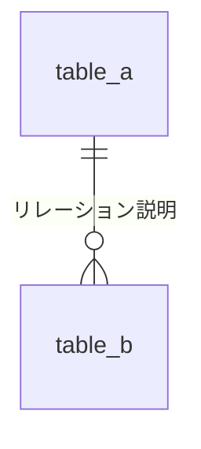

---
# 機械処理用メタデータ（健全度チェック・インデックス生成で使用）。人間は「概要・業務目的」から読む。
id: { 画面ID。例: A001 }
name: { 画面名（日本語）。例: 契約一覧 }
url: { ルーティングURL。例: '/contracts' }
permission: { 主要権限フラグ・ロール。複数なら配列 }
related_dds:
  - { 関連DD番号。例: DD-009 }
status_check: { コードとの整合性を最後に確認した日。YYYY-MM-DD }
status: { stable / wip / deprecated / unknown }
---

# 画面仕様書: {画面名}

> 🤖 **テンプレ運用ルール**:
> - 必須セクション（概要・業務目的 / ビジネスルール / 権限 / 画面UI / 実装仕様 / 変更ログ）は省略禁止
> - 任意セクション（ER図 / 過去トラブル）は不要なら見出しごと削除
> - フロントマターは全項目記入（不明な項目は `unknown` と書く）
> - 画面の挙動・認可・URL・参照テーブルを変更したら本書も同じ変更で更新し、`status_check` を更新日に直す

---

## 概要・業務目的

> 👥 読み手: 人間（事業責任者 / 新任開発者）。この画面で誰が何のために何をするか、1〜2段落で。

{画面名} は、{ユーザー像} が {目的} のために使用する画面。具体的には {主な操作} を行う。{業務上の位置づけ・前後関係}。

## ビジネスルール

> 👥 読み手: 人間。業務目線のルール・制約・ステータス遷移。「なぜこうなっているのか」を書く。

| 状態 | 操作 | 結果 |
|------|------|------|
| {前状態} | {操作} | {遷移後 / エラー / 制約} |

## 権限・認可

> 👥 読み手: 人間 + LLM。誰が何をできるか、どの層で制御しているか。

### ロール × 操作 マトリクス

| 操作 | {ロール1} | {ロール2} | 権限なし |
|------|:---:|:---:|:---:|
| 画面表示 | ✅ | ✅ | ❌ |
| {操作1} | ✅ | ❌ | ❌ |

### 認可境界（どの層で守っているか）

| 層 | 制御内容 |
|----|--------|
| メニュー / 画面表示 | {表示条件・ルートガード} |
| API | {エンドポイント側のガード} |
| ビジネス制約 | {ハンドラ内の状態依存分岐} |

## 画面UI仕様

### 主要UI要素

- **{セクション名}**: {含まれる要素・操作}

### 呼び出すAPI

| メソッド | パス | 用途 |
|---------|------|------|
| GET | `/xxx` | {用途} |

## 実装仕様（LLM・開発者向け）

> 🤖 読み手: LLM + 開発者。ファイル位置・テーブル参照・主要ロジック位置。詳細はコードを正とする。

- フロントエンド本体: `{パス}`
- バックエンドハンドラ: `{パス}`

### 読み取り / 書き込みテーブル

| テーブル | 操作 | 用途 |
|---------|------|------|
| {table_name} | SELECT / INSERT / UPDATE | {用途} |

### 主要ビジネスロジック位置

| ルール | 位置 | 概要 |
|--------|------|------|
| {ルール名} | `{ファイル}:{行}` | {1行説明} |

## ER図（任意）

> 関連テーブルが3つ以上、または親子・多対多リレーションを含む場合のみ。不要なら見出しごと削除。

## 過去トラブル・既知の落とし穴（任意）

> 1事象あたり「発生日・症状・原因・恒久対策・関連DD」を3〜5行で。詳細は元DDが正本。

## 変更ログ

> 仕様書の更新履歴。形式: `### YYYY-MM-DD` + 箇条書き。

### {YYYY-MM-DD}
- 初版作成
